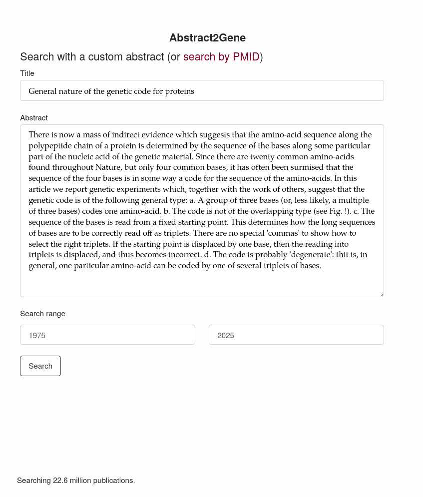
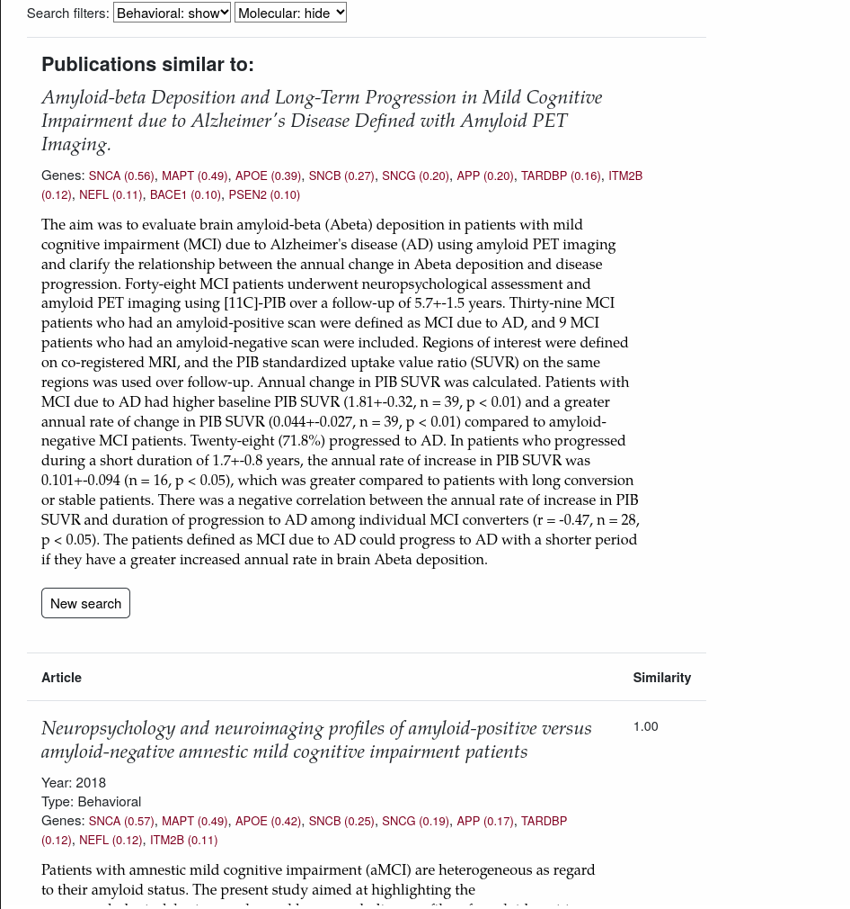

# Abstract2Gene

This repository is the official implementation of [Abstract2Gene]().

A Large Language Model for searching medical documents based on similarity in genes studied.
The model uses publication abstracts to predict gene associations which can be used to calculate distance between pairs of publications.
We used this model to design a new medical research search engine over the PubMed publication database.

## Abstract2Gene search engine

The aim of this project is to set up a search engine to find references for medical research.
A user can either pass in a working title and abstract of their work or can search based on publications that exist in the PubMed database.



At the homepage the user can add their abstract.
The above is the introductory paragraph to Crick and Watson's paper on DNA.



Showing similar publications for [Amyloid-β Deposition and Long-Term Progression in Mild Cognitive Impairment due to Alzheimer's Disease Defined with Amyloid PET Imaging (PMID: 28304292)](https://pubmed.ncbi.nlm.nih.gov/28304292/).
By default the search engine shows 20 results per page, giving the results title, full abstract, similarity score, top predicted genes, publication year, and whether PubTator3 provided annotations for the publication (if so type is molecular, otherwise behavioral).
Beneath each entry are options to search using this publication's abstract, go to the PubMed entry, or, when reference data is available, look at the publication's references.

## Organization

The three directories to care about in this repository are `abstract2gene`, `example`, and `wabapp`.
The first provides the main python package.
All scripts needed to reproduce the publications results (and additional experiments) are found in `example`.
Then `webapp` provides a second python package with modules for running the search engine.

There are multiple goals of this repository: provide the `abstract2gene` model and the required code to run it on abstracts, reproduce the publication results, and running the search engine locally.

For the first two goals, the package can be installed from PyPI using pip or uv (see the "Installing python package" section below).
To run the search engine, we suggest using the docker method.

### Reproducing results

There are three stages of results, producing the dataset, fine-tuning the embedding model, and running the examples.
Creating the dataset requires downloading ~170GB of archives and will take ~hours to days to run depending on the computer being used.
While performing the finetune requires several 10s of GB VRAM.
Since these two tasks are slow and computationally heavy, both the [dataset](https://huggingface.co/datasets/dconnell/pubtator3_abstracts) and [finetune](https://huggingface.co/dconnell/SPECTER2-abstract2gene) have been uploaded to huggingface, which can be used to run the remaining examples.

After the fine-tuning, the final layer of the abstract2gene still needs to be trained locally.
Due to the custom training loop and the combination of models it was not obvious how to upload these weights to the Hugging Face hub in a way that was easy to use.
However, the number of weights to train is small and its training should be doable without a GPU.
The remaining examples should not take too much compute.

Running the scripts to reproduce the results should be run in the order:

- (optional) example/training/create_from_bioc.py
- (optional) example/training/embedding_model_selection.py
- (optional) example/training/finetune_encoder.py
- (optional) example/training/upload_to_hub.py
- (required) example/training/train_abstract2gene.py

This can be performed by running `make train`.

After this, the remaining examples can be run in any order.
If creating the dataset and fine-tuning the encoder model, the `upload_to_hub` script should be run to make them available on the Hugging Face dataset and model hubs.
In this case make sure to change the `hf_user` in the configuration TOML (see below) to an account you have access to.
The rest of the examples will assume they are available there.

### A note on reproducibility

Using the `a2g.toml` it's possible to set the random seeds to pass to experiments.
If these are not set, the default seeds will be the same I used and should produce the same results.
The `uv` package manager should reproduce the exact python environment used.
In theory, I believe each script should return the exact results presented in the publication on different computers.
One place that is likely to not be reproducible is creating the dataset since this depends on downloading files from PubTator3's ftp server which is expected to be updated over time.
As such, results may differ if using a self-generated dataset instead of the dataset uploaded to Hugging Face.

## Installing python package

To install:

```setup
pip install abstract2gene
```

Or setting up the environment with uv

```uv
git clone "github.com/net-synergy/abstract2gene.git"
cd abstract2gene
uv sync
```

## Configuration

An `a2g.toml` file can be created in the project's root to control how the examples and webapp are run.
The below is an example of a TOML file:

``` toml
[experiments]
hf_user = "dconnell"
max_cpu = 4

[experiments.seeds]
train_abstract2gene = 35

[experiments.embedding-models]
mpnet = "microsoft/mpnet-base"

[experiments.figures]
type = "pdf"
text_width=6.26894
use_tex = true
font_family = "Palatino"
font_size = 10

[site]
[site.engine]
labels_per_batch = 64

[site.ui]
min_genes_displayed = 5
gene_thresh = 0.5
results_per_page = 20

[site.auth]
enabled = true
```

This provides the most common values to alter.
The `hf_user` is where to upload and download the dataset and embedding model from.
If not generating the dataset or fine-tuning the embedding model, `hf_user` should be left as the default (can be excluded from the TOML).
To create a dataset and fine-tune, the user should be changed to a Hugging Face account you have access to and the Hugging Face hub package should be used to log into that account before attempting to run the upload to hub example.

### Seeds

Each example is given a seed for random number generation.
By default this seed is 10 times the script number (somewhat random order).
Any values in the `experiments.seeds` section will overwrite the default seed for that example.
Where an example is referenced by its python script name excluding the `py` extension.
If a value in this section does not match one of the existing keys, it will be ignored.
Look at `example/_config.py` for the default scripts.
Also note, not every script uses their seed but every script is given a seed for consistency.

### Embedding models

This is only used for selecting an embedding model to use.
Only the models listed in the `experiments.embedding-models` section will be compared.
These models can differ from the originally used models.

### Figures

By default all figures are saved as PNGs with 600dpi.
This can be changed to any format supported by matplotlib.
Text width should be based on the document these figures will be embedded in.
This is in inches and most figures will have a width 0.9 times this with a height calculated using the golden ratio.
The label similarity figures, being square heatmaps, instead have equal width and height that is 0.7 times the text width.
Using `tex` requires `tex` to be installed with the desired font family.
By default, matplotlib handles these values (so if there's a .matplotlibrc the values in that file will influence the results unless overridden in the TOML file).

### Site

The site values are explained in the `webapp/README.md`.

## Creating the Bioc dataset

To create the Bioc dataset run the following example:

``` shell
python example/create_from_bioc.py --n_cpu 32
```

This may produce a slightly different dataset than the one on Hugging Face if the upstream PubTator3 BioCXML archive files have been updated.
As with the encoder, the scripts default to using the dataset on Hugging Face's hub.
Note the `--n_cpu` flag can be replaced by setting the `max_cpu` value in the configuration TOML.

## Training

To train the model(s) in the paper, run this command:

``` shell
make train
```
> [!IMPORTANT]
> To test the experiments with a new dataset and fine-tune make sure to set the `hf_user` in the TOML and run the the upload to hub script before running the remaining experiments.

Note that the embedding selection is not automated.
To change the model selected for fine-tuning or the hyperparameters used, you need to modify the script directly.

## Pre-trained Models

If using the dataset and model already created, nothing more needs to be done.
These will be downloaded when running the remaining scripts

## Training the abstract2gene model

Whether using the pre-trained model or fine-tuning the embedding model yourself, the final abstract2gene model still needs to be trained before performing the experiments.
This adds a single layer on top of the embedding model so it is not too computationally demanding (although multiple models will be trained for different labels per batch values).

``` shell
python example/train_abstract2gene.py
```

## Experiments

The experiments can be run with `make experiments`.
Logged results will end up in the directory `results` and figures will go to `figures`.
